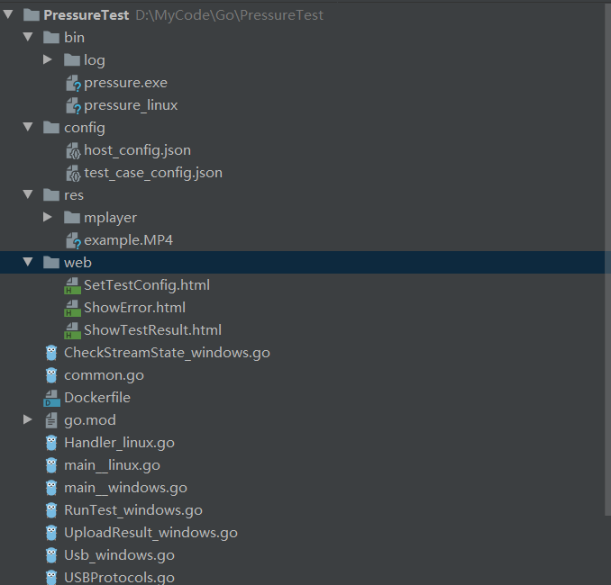

## 云电脑压测程序文档


#### 1.开发环境配置

​	先安装go开发环境,参考下文

​	https://blog.csdn.net/Kenny_cn/article/details/88984965

​	安装完后,记得设置Module环境变量如下

```shell
//linux 
export GO111MODULE=on
//windows
set GO111MODULE=on
```
由于项目中用了cgo,所以还要需要安装mingw-w64,官网如下:
http://www.mingw-w64.org/doku.php
由于项目中的第三方库依赖于github,所以需要安装git,官网如下:
http://www.mingw-w64.org/doku.php

ide推荐goland

goland在Linux上远程开发环境搭建方法如下

https://blog.csdn.net/fkewksai/article/details/83062157

#### 2.项目目录介绍



​	bin中保存编译出来的二进制文件、config中保存了测试用例和一些配置、web中保存了要展示结果和错误的web页面、res中保存了一些要用到的工具、他根目录的下的.go文件都是源码文件，_windows结尾的代码文件在编译windows版本的程序时会被使用，_linux结尾的代码文件在编译Linux版本的程序时会被使用，没有后缀的代码文件是通用的、go.mod包含了程序所依赖的库描述。

#### 3.服务端流程介绍

​	服务端使用了go的gin框架,主要思想就是一个api对应一个处理函数,结构比较简单易懂。

```go
func main() {

	router := gin.Default()
    //函数退出时关闭数据库和log文件
	defer myDB.Close()
	defer logFile.Close()
	//读取网页
	router.LoadHTMLGlob("../web/*")

	// API 定义开始
	//分发测试用例
	router.GET("/case",DispatchTestCase)

	//网页
	web:=router.Group("/web")
	{
		web.GET("/config", func(context *gin.Context) {
			// 返回HTML文件
			context.HTML(http.StatusOK, "SetTestConfig.html", nil)
		})

		web.GET("/result", func(context *gin.Context) {
			// 返回HTML文件
			context.HTML(http.StatusOK, "ShowTestResult.html", nil)
		})

		web.GET("/error", func(context *gin.Context) {
			// 返回HTML文件
			context.HTML(http.StatusOK, "ShowError.html", nil)
		})
	}

	//省略一部分代码.............
    
	//设置测试用例
	set := router.Group("/set")
	{
		set.POST("/rawConfig", SetRawConfig)
	}
	//服务运行在本机的80端口
	err := router.Run(":80")
	if err!=nil{
		log.Fatal("gin run fail")
	}

}
```

#### 4.网页展示

​	网页展示这块主要流程如下：浏览器向服务器请求对应web页面->服务器下发web页面->web中内嵌的js脚本向服务器请求数据->服务器从数据库查询并且发送给web页面->web页面对结果进行展示，web页面代码示例如下

```html
<script type="text/javascript">
    var table=document.getElementById("table");
	//请求web服务器
    const url="http://10.1.108.250/query/result ";
    fetch(url, {
        method:'GET',
        mode:'cors',// 允许发送跨域请求
        credentials: 'include',

    }).then(function(response){
		
        return response.text()
        }).then(function (body) {
		//获取到服务器返回的数据(用\n分隔的json字符串)
        body.split("\n").forEach(function (v,i) {
            if( v!==''){
                //解析json,并且动态插入到html文本中
                jsonobj=eval('(' + v + ')');
                var row=table.insertRow(table.rows.length);
                row.insertCell(0).innerHTML=jsonobj.IP;
                row.insertCell(1).innerHTML=jsonobj.TimeStamp;
                row.insertCell(2).innerHTML=jsonobj.Loss1;
                row.insertCell(3).innerHTML=jsonobj.Loss2;
                //省略以下代码..........
```


#### 5.云主机端流程介绍

​	云主机端我为了方便也是用go写的，但是为了更好和串流程序通信，或者需要调用sdk等，还是建议用C++写比较好一点。主要代码流程如下：

```go
func main() {
	//testcode()
	CreateDir("./log")
	logfile:=setLogOutput("./log/clientlog.txt")
	defer logfile.Close()

	content, err := ioutil.ReadFile("../config/host_config.json")
	checkError(err)

	// 获取配置
	err = json.Unmarshal(content, &hostConfig)
	checkError(err)
	log.Printf("load host config %+v",hostConfig)
	
	//这里主要根据串流程序的tcp链接去找到盒子端的ip,
	//然后根据盒子端的ip连接到盒子的键鼠模拟器程序
	Connect2Box()

	//向服务器请求测试用例
	GetTestCase(hostConfig.URL+"/case")

	//运行所有测试用例,usb,视频,游戏片段等...
	RunAllCase()
	//time.Sleep(time.Minute)

}

```

云主机端的代码有两个要注意的点:

1. 我把任妍开发压测程序的一些错误检测逻辑合到我的代码中(详情请见CheckStreamState_windows.go),但是如果串流程序是以服务运行的,那么就需要把压测程序也以服务启动,否则check_video,check_audio会一直失败**。

```go
//若要开启串流程序的video audio检测,解除这里的注释
func RunAllCase(){
	//todo 这里的代码要把程序改成服务运行才可以生效
	//go func() {
	//	for true {
	//		if !check_video(){
	//			break
	//		}
	//		time.Sleep(time.Second)
	//	}
	//
	//	syscall.Exit(1)
	//}()
    
	//省略后面的代码...........
```

2. 主机端的hook,我用到了"github.com/robotn/gohook"这个第三方库,但是我在本地对这个库有修改,如果你直接从网上下载这个库并且直接使用的话是会报错的,所以这里直接把我修改后的hook.go文件放在这里**。

```go
// Copyright 2016 The go-vgo Project Developers. See the COPYRIGHT
// file at the top-level directory of this distribution and at
// https://github.com/go-vgo/robotgo/blob/master/LICENSE
//
// Licensed under the Apache License, Version 2.0 <LICENSE-APACHE or
// http://www.apache.org/licenses/LICENSE-2.0> or the MIT license
// <LICENSE-MIT or http://opensource.org/licenses/MIT>, at your
// option. This file may not be copied, modified, or distributed
// except according to those terms.

package hook

/*
#cgo darwin CFLAGS: -x objective-c -Wno-deprecated-declarations
#cgo darwin LDFLAGS: -framework Cocoa

#cgo linux CFLAGS:-I/usr/src
#cgo linux LDFLAGS: -L/usr/src -lX11 -lXtst
#cgo linux LDFLAGS: -lX11-xcb -lxcb -lxcb-xkb -lxkbcommon -lxkbcommon-x11
//#cgo windows LDFLAGS: -lgdi32 -luser32

#include "event/goEvent.h"
*/
import "C"

import (
	"fmt"
	"log"
	"sync"
	"time"
	"unsafe"
)

const (
	// Version get the gohook version
	Version = "v0.30.4.100, Sierra Nevada!"

	// HookEnabled honk enable status
	HookEnabled  = 1 // iota
	HookDisabled = 2

	KeyDown = 3
	KeyHold = 4
	KeyUp   = 5

	MouseUp    = 6
	MouseHold  = 7
	MouseDown  = 8
	MouseMove  = 9
	MouseDrag  = 10
	MouseWheel = 11

	FakeEvent = 12

	// Keychar could be v
	CharUndefined = 0xFFFF
	WheelUp       = -1
	WheelDown     = 1
)

// Event Holds a system event
//
// If it's a Keyboard event the relevant fields are:
// Mask, Keycode, Rawcode, and Keychar,
// Keychar is probably what you want.
//
// If it's a Mouse event the relevant fields are:
// Button, Clicks, X, Y, Amount, Rotation and Direction
type Event struct {
	Kind     uint8 `json:"id"`
	When     time.Time
	Mask     uint16 `json:"mask"`
	Reserved uint16 `json:"reserved"`

	Keycode uint16 `json:"keycode"`
	Rawcode uint16 `json:"rawcode"`
	Keychar rune   `json:"keychar"`

	Button uint16 `json:"button"`
	Clicks uint16 `json:"clicks"`

	X int16 `json:"x"`
	Y int16 `json:"y"`

	Amount    uint16 `json:"amount"`
	Rotation  int32  `json:"rotation"`
	Direction uint8  `json:"direction"`
}


var (
	ev      = make(chan Event, 1024)
	asyncon = false

	lck sync.RWMutex


	pressed = make(map[uint16]bool, 256)
	used    = []int{}

	keys   = map[int][]uint16{}
	cbs    = map[int]func(Event){}
	mevent *Event
	mcb   = func(Event){}
	events = map[uint8][]int{}
)

func allPressed(pressed map[uint16]bool, keys ...uint16) bool {
	for _, i := range keys {
		// fmt.Println(i)
		if !pressed[i] {
			return false
		}
	}

	return true
}

// Register register gohook event
func Register(when uint8, cmds []string, cb func(Event)) {
	key := len(used)
	used = append(used, key)
	tmp := []uint16{}

	for _, v := range cmds {
		tmp = append(tmp, Keycode[v])
	}
	keys[key] = tmp
	cbs[key] = cb
	events[when] = append(events[when], key)
	log.Println("Register keycode : ",cmds)
	// return
}

func RegisterMouse(m Event,cb func(Event)){
	mevent=&m
	mcb=cb
	log.Println("Register Mouse : ",mevent)
}

func UnRegister() {
	used    = []int{}
	keys   = map[int][]uint16{}
	cbs    = map[int]func(Event){}
	mevent=nil
	mcb=nil
	events = map[uint8][]int{}
	//log.Println("UnRegister")
}

// Process return go hook process
func Process(evChan <-chan Event) (out chan bool) {
	out = make(chan bool)
	go func() {
		for ev := range evChan {
			//log.Println(ev)
			if ev.Kind == KeyDown || ev.Kind == KeyHold {
				//log.Println(ev.Keycode)
				pressed[ev.Keycode] = true
			} else if ev.Kind == KeyUp {
				pressed[ev.Keycode] = false
			}else if (ev.Kind==MouseDown||ev.Kind==MouseMove)&&mevent!=nil&&mcb!=nil {
				log.Println("Hook Event kind = MouseEvent,X = ", ev.X, "Y = ", ev.Y)
				if ev.Button == mevent.Button &&
					mevent.X == ev.X &&
					mevent.Y == ev.Y {
					mcb(ev)
				}
			}
			//}else if ev.Kind==MouseMove&&mevent!=nil&&mcb!=nil{
			//	//newX:=mevent.currentX+mevent.offsetX
			//	//newY:=mevent.currentY+mevent.offsetY
			//	log.Println("Hook Event kind = MouseMove,X = ",ev.X,"Y = ",ev.Y)
			//	if ev.Button==mevent.Button&&
			//		mevent.X==ev.X&&
			//		mevent.Y==ev.Y{
			//		mcb(ev)
			//	}
			//}

			for _, v := range events[ev.Kind] {
				if !asyncon {
					break
				}

				if allPressed(pressed, keys[v]...) {
					cbs[v](ev)
				}
			}
		}
		// fmt.Println("exiting after end (process)")
		out <- true
	}()

	return
}

// String return formatted hook kind string
func (e Event) String() string {
	switch e.Kind {
	case HookEnabled:
		return fmt.Sprintf("%v - Event: {Kind: HookEnabled}", e.When)
	case HookDisabled:
		return fmt.Sprintf("%v - Event: {Kind: HookDisabled}", e.When)
	case KeyUp:
		return fmt.Sprintf("%v - Event: {Kind: KeyUp, Rawcode: %v, Keychar: %v}",
			e.When, e.Rawcode, e.Keychar)
	case KeyHold:
		return fmt.Sprintf(
			"%v - Event: {Kind: KeyHold, Rawcode: %v, Keychar: %v}",
			e.When, e.Rawcode, e.Keychar)
	case KeyDown:
		return fmt.Sprintf(
			"%v - Event: {Kind: KeyDown, Rawcode: %v, Keychar: %v}",
			e.When, e.Rawcode, e.Keychar)
	case MouseUp:
		return fmt.Sprintf(
			"%v - Event: {Kind: MouseUp, Button: %v, X: %v, Y: %v, Clicks: %v}",
			e.When, e.Button, e.X, e.Y, e.Clicks)
	case MouseHold:
		return fmt.Sprintf(
			"%v - Event: {Kind: MouseHold, Button: %v, X: %v, Y: %v, Clicks: %v}",
			e.When, e.Button, e.X, e.Y, e.Clicks)
	case MouseDown:
		return fmt.Sprintf(
			"%v - Event: {Kind: MouseDown, Button: %v, X: %v, Y: %v, Clicks: %v}",
			e.When, e.Button, e.X, e.Y, e.Clicks)
	case MouseMove:
		return fmt.Sprintf(
			"%v - Event: {Kind: MouseMove, Button: %v, X: %v, Y: %v, Clicks: %v}",
			e.When, e.Button, e.X, e.Y, e.Clicks)
	case MouseDrag:
		return fmt.Sprintf(
			"%v - Event: {Kind: MouseDrag, Button: %v, X: %v, Y: %v, Clicks: %v}",
			e.When, e.Button, e.X, e.Y, e.Clicks)
	case MouseWheel:
		return fmt.Sprintf(
			"%v - Event: {Kind: MouseWheel, Amount: %v, Rotation: %v, Direction: %v}",
			e.When, e.Amount, e.Rotation, e.Direction)
	case FakeEvent:
		return fmt.Sprintf("%v - Event: {Kind: FakeEvent}", e.When)
	}

	return "Unknown event, contact the mantainers."
}

// RawcodetoKeychar rawcode to keychar
func RawcodetoKeychar(r uint16) string {
	lck.RLock()
	defer lck.RUnlock()

	return raw2key[r]
}

// KeychartoRawcode key char to rawcode
func KeychartoRawcode(kc string) uint16 {
	return keytoraw[kc]
}

// Start adds global event hook to OS
// returns event channel
func Start() chan Event {
	ev = make(chan Event, 1024)
	go C.start_ev()

	asyncon = true
	go func() {
		for {
			if !asyncon {
				return
			}

			C.pollEv()
			time.Sleep(time.Millisecond * 50)
			//todo: find smallest time that does not destroy the cpu utilization
		}
	}()

	return ev
}

// End removes global event hook
func End() {
	asyncon = false
	C.endPoll()
	C.stop_event()
	time.Sleep(time.Millisecond * 10)

	for len(ev) != 0 {
		<-ev
	}
	close(ev)

	pressed = make(map[uint16]bool, 256)
	used = []int{}

	keys = map[int][]uint16{}
	cbs = map[int]func(Event){}
	events = map[uint8][]int{}
}

// AddEvent add event listener
func AddEvent(key string) int {
	cs := C.CString(key)
	defer C.free(unsafe.Pointer(cs))

	eve := C.add_event(cs)
	geve := int(eve)

	return geve
}

// StopEvent stop event listener
func StopEvent() {
	C.stop_event()
}

```

#### 6.编译和部署

使用ide编译(goland): 点击工具栏中的run->edit configurations


使用命令行编译

```shell
CGO_ENABLED=0 GOOS=windows GOARCH=amd64 go build test.go
CGO_ENABLED=0 GOOS=linux GOARCH=amd64 go build test.go
```

部署服务端直接启动bin目录下的Linux版本程序即可,程序用的基本都是相对路径,建议不要去破坏目录的结构,云主机端同理。


程序结构如下图

